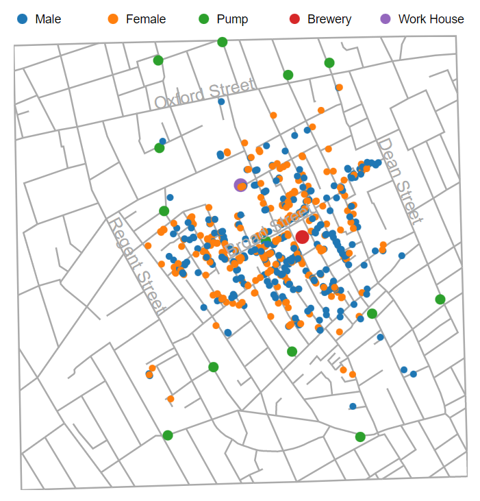
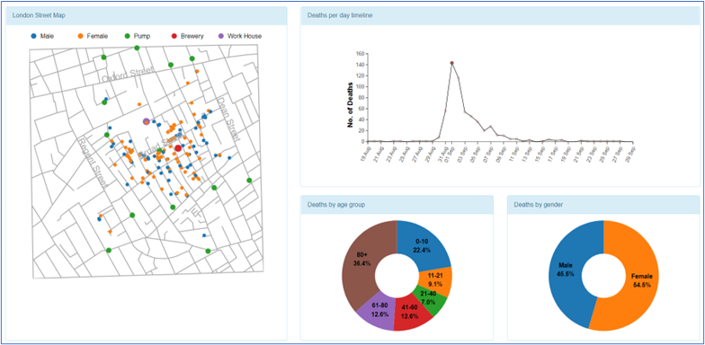
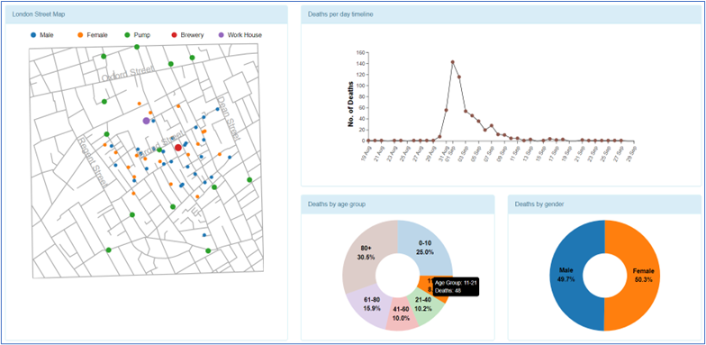
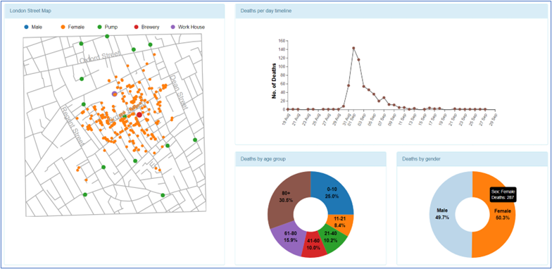
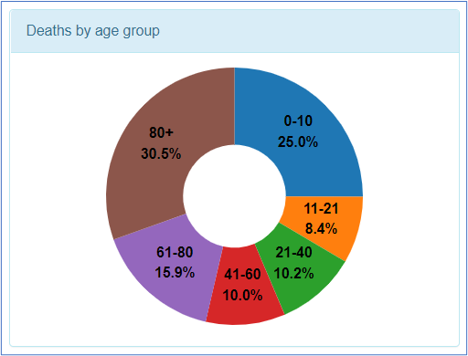
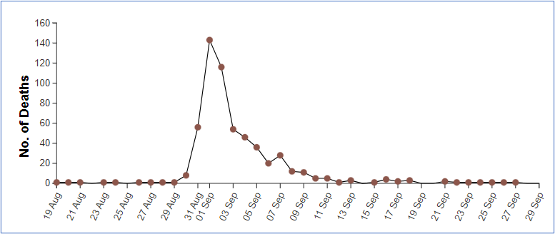

# Follow this [link](https://balajisolanki.github.io/cholera-outbreak) for the live application

## **About**

The main goal of this project is to use the D3 library to reconstruct Dr. John Snow's map. Along with reconstructing the original map in an interactive format, I also added extra charts to the map's side and interface components to make the data more engaging.

This project is created by [Balaji Rao Solanki](https://balajisolanki.github.io) as part of the H517 - Visualization Design, Analysis, & Evaluation course.

_**The datasets used are**_

* [streets.json](https://khreda.com/teaching/fall22/H517/project1/cholera_data/streets.json) - Provides a set of line segments representing the street coordinates. The file is constructed as a JSON array or arrays; the higher-level array essentially contains a list of all street segments. Each street segment is represented by an array of X, Ytuples, or the segment's vertices.
* [pumps.csv](https://khreda.com/teaching/fall22/H517/project1/cholera_data/pumps.csv) - Provides the (X, Y) coordinates of the pumps on the street map.
* [deathdays.csv](https://khreda.com/teaching/fall22/H517/project1/cholera_data/deathdays.csv) - Provides the number of deaths for each day of the outbreak.
* [deaths_age_sex.csv](https://khreda.com/teaching/fall22/H517/project1/cholera_data/deaths_age_sex.csv) - Provides the age and sex of the victim together with the (X, Y) coordinates of each death in the death days file, in sequence.

[Click here](https://khreda.com/teaching/fall22/H517/project1) for detailed information about the problem statement.

[Click here](https://balajisolanki.github.io/cholera-outbreak/data/Cholera%20Outbreak%20Documentation.pdf) to download the PDF version of this documentation.

## **Design**

**1. Layout**
Based on my understanding of the datasets, I started outlining the dashboard's basic layout after becoming familiar with the data and the information in the dataset the image here.

**2. Design Choices**

I used bootstrap CSS for the responsiveness of the page and the whole website is designed for almost all the screens starting from a mobile device with minimum screen width of 700px. I have used grid layout, panels, nav bars, responsive tables provided by bootstrap library. Alongside bootstrap, I have also written some part of custom CSS to customize my web pages.

* Map lines are drawn using dark grey, this was done to provide clean lines that don't distract from the scatter plot of deaths

* Pumps are plotted in green and larger circles than death points so that they are noticeable and do not interfere with the death points.

* Death points are in blue and orange for male and female victims respectively and the same has been used in the gender donut chart.

## **Visualizations**

* Created a stable interactive map with streets, water pumps, landmarks, and victims’ locations. Pumps, brewery and work house points zoomed when the cursor is hovered on the respective item in the legend.

    

* Created an interactive time series graph with the number of deaths per day during the epidemic and with cursor events, a tooltip will be displayed on the data points in the chart.

    

* When a data point is selected/unselected by clicking on it the death points will be updated and both gender and age group donut charts will be redrawn for the deaths of the selected days. You can find these differences in the these two pictures.

    

    

* Both the donut charts are interactive, when the mouse is hovered a tooltip will display the more information about the selected arc/pie in the donut chart and the death points will be updated on the street map. The other arcs/pies will be blurred when a pic/arc is focused. Changes can be observed in the default dashboard picture vs below pictures.

    
    
    

## **Observations**

* Young individuals and older adults die more frequently than persons of other ages, as it is evident from the age group donut chart. This pattern is in line with the idea that younger and older persons tend to have more virulent infectious illnesses.

    

* A collection of instances centered on a certain pump could be seen on the map with clarity. That cholera was being transmitted by contaminated water is made clearer by this.

    

* From the time series plot, the death rate spiked from Aug 30 to Sep 10

    

## **References**

* [D3 Wiki](https://github.com/d3/d3/wiki)
* [D3 Examples](https://getbootstrap.com/docs/3.4/components)
* [Bootstrap Components](https://getbootstrap.com/docs/3.4/components)
